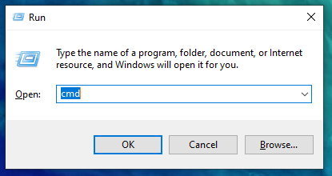
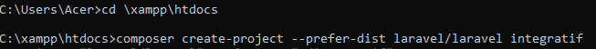
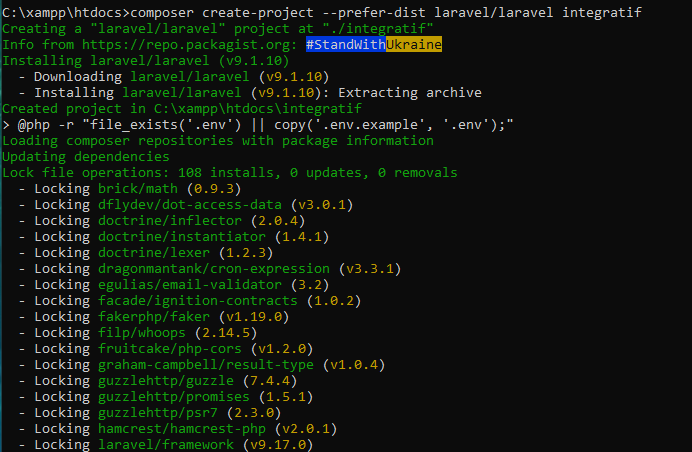
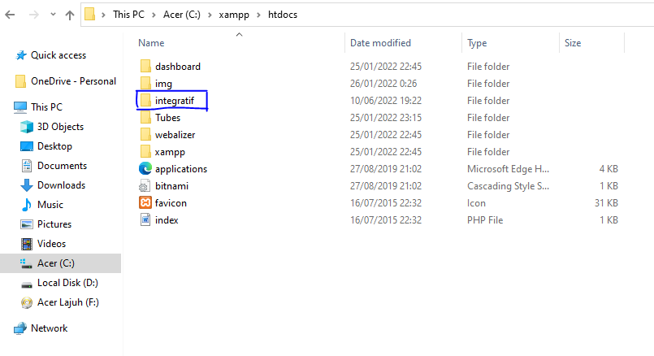
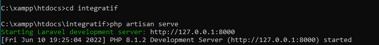
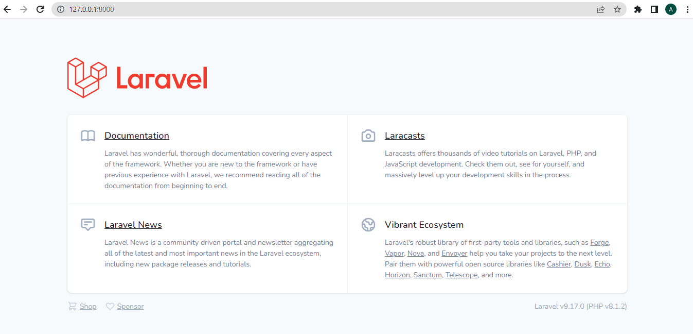

# Install Laravel #

### 1. Masuk Command Prompt ###

### 2. Masuk ke Folder XAMPP ###

    cd \xampp\htdocs

### 3. Mulai Proses Install Laravel ###

    composer create-project --prefer-dist laravel/laravel nama_project

### 4. Cek Instalasi Laravel di Web Browser ###

Setelah download selesai, nantinya akan ada folder baru pada direktori file yang telah dibuat. /xampp/htdocs.

    php artisan serve

Langkah selanjutnya, membuka tautan yang disediakan oleh laravel. 127.0.0.1:8000

