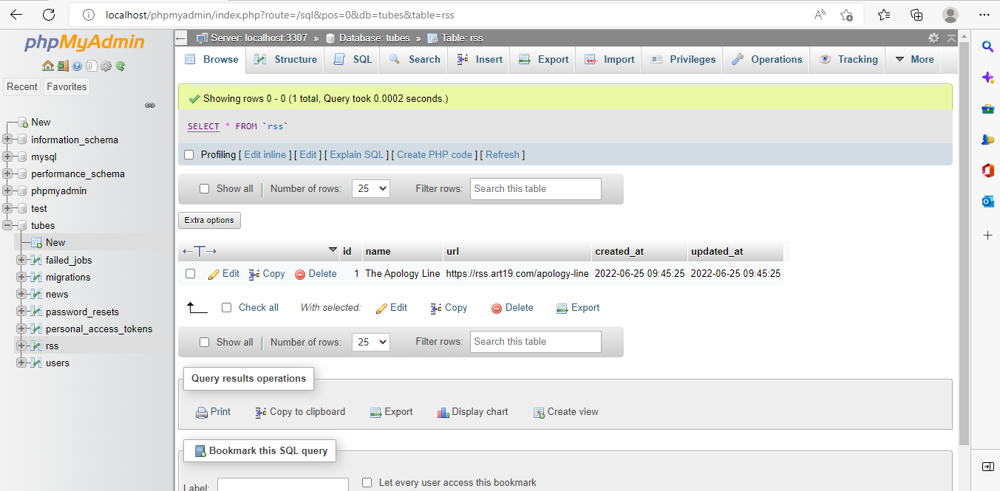

# INTEGRATIF PHARSE 2 #

Mengubah DB_DATABASE di .env sesuai dengan nama database yang dibuat di phpmyadmin

Buat 2 migrations yaitu table rss dan news

    - php artisan make:migration create_rss_table
    - php artisan make:migration create_news_table

Tambahkan kolom name dan url pada tabel rss, seperti pada gambar dibawah

Tambahkan kolom title, img_url, description, source_url,  dan rss_id pada tabel news, seperti pada gambar dibawah

Untuk menjalankan migrasi yang dibuat, jalankan perintah

    php artisan migrate

Buat koneksi  model  ke database  dengan membuat seeder dan controller untuk tabel Rss dan News, dengan command

    php artisan make:model Rss –-seed –-controller

Tambahkan script  (protected $table = 'rss';) pada file Rss.php dan ubah file RssSeeder.php serta DatabaseSeeder.php seperti pada gambar dibawah

Kemudian cek koneksi dengan perintah

    php artisan db:seed

    php artisan make:model News –-controller

Tambahkan script  (protected $table = 'news';) pada file News.php dan ubah file NewsController.php serta web.php seperti pada gambar dibawah

Cek localhost http://127.0.0.1:8000/aggregrate/1 

Buat logic untuk get rss data dengan id_rss, dengan script seperti pada gambar dibawah

Parsing XML ke Object
Tuliskan script seperti pada gambar dibawah

Cek hasilnya di localhost http://127.0.0.1:8000/aggregrate/1

Buat script seperti pada gambar dibawah untuk menyimpan data pada tabel News

Cek database pada tabel News

Cek localhost http://127.0.0.1:8000/aggregrate/1

Cek localhost http://127.0.0.1:8000/aggregrate/2

Cek localhost http://127.0.0.1:8000/aggregrate/4

### TETEP SEMANGAT LURR ###